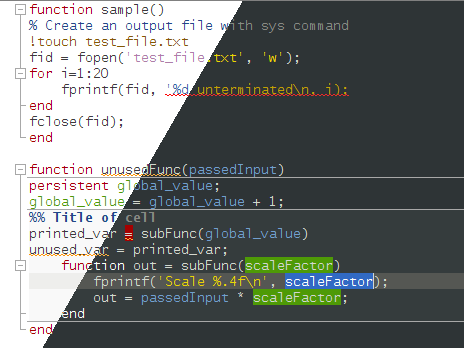
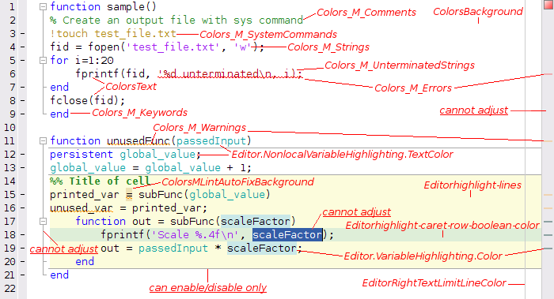

[][fex]

MATLAB Schemer
==============

This MATLAB package makes it easy to change the color scheme (a.k.a. theme) of
the MATLAB display and GUI.

You can use Schemer to import a predefined color scheme, transfer your color
settings between installations, or create your own color scheme.

A collection of color schemes is available in the schemes folder.
Samples of these can be seen in [schemes/README.md](schemes/README.md),
and browsed in the folder [schemes/screenshots](schemes/screenshots).
This is a static subtree copy of the contents of the repository
[matlab-schemes].

Importing a color scheme
------------------------

Color schemes can be easily imported by running `schemer_import` at the MATLAB
command prompt, without needing any inputs. This will open a GUI to select the
file to import the color scheme from.

When importing a color scheme, most of the settings will change immediately.
However, some settings will require MATLAB to be restarted:
- Variable highlighting colours
- Wavy underlines for errors
- Wavy underlines for warnings

For more details, see the documentation on the function `schemer_import`,
available with `help schemer_import`.

Transferring a color scheme between MATLAB installations
--------------------------------------------------------

If you are using a personalised color scheme in MATLAB, you may wish to save
it for yourself so you can re-implement it easily if you reintall MATLAB.
Or you may wish to transfer your personalised color scheme from one machine
to another. This section describes the steps relevant in either scenario.

On the source machine, run `schemer_export` to save a temporary color scheme
file, and then transfer this file to the destination machine.

When importing the new color scheme, instead of running `schemer_import` without
any inputs, you should run `schemer_import(true)`. This passes a flag to tell
the function to not only import the colour preferences, but to also import your
boolean settings (such as whether to highlight the current cell/line, etc)
from the file you exported from the source installation.

Reverting to the MATLAB default color scheme
--------------------------------------------

Should you wish to revert to the set of colours which MATLAB ships with, you
should run `schemer_import('schemes/default.prf')`.

This will import the MATLAB default theme from the stylesheet `default.prf`
which comes as part of Schemer.

To restore the out-of-the-box state for boolean settings (such as whether to
highlight the current line) in addition to the colours, run
`schemer_import('schemes/default.prf', true)`.

You may be tempted to instead revert the colours by clicking the
`Restore Default Colors` buttons in the `Color` pane of the MATLAB preferences.
However, this will be less effective than importing the default colours through
Schemer because these buttons will not reset all the MATLAB colour preferences.
(There is no reset button for the Editor display preferences pane, nor for the
other language syntax supported by MATLAB, which is available in the Editor
Languages panel.)

Creating a color scheme for others to use
-----------------------------------------

When creating a color scheme to share with the rest of the world, it is
recommended to ensure colours are chosen appropriately for all possible
settings, even if they are not enabled.

For example, if you are creating a dark colour scheme, you may have cell
highlighting disabled but it would still be ill-advised to leave the background
highlight colour for cell displays as the default pale beige because other users
may have this setting enabled.

### Exporting through the GUI

If you have made a custom color scheme using the MATLAB GUI to pick the colours,
you can export the new color scheme with `schemer_export`.

Please note, this requires you to have visited all relevant panes of the
Preferences window at least once since MATLAB was installed, even if the
settings have not been changed from the default.
See the help for `schemer_export` for more details.

### Porting a theme from a different editor

If you are converting a color scheme designed for another editor into a MATLAB
stylesheet, you may find it easier to start with a duplicate of the template
stylesheet [develop/template_scheme.prf](develop/template_scheme.prf) and copy
the colours into this.

To understand which colour settings the parameter names correspond to, you can
refer to the annotated screenshot,
[develop/annotated_default.png](develop/annotated_default.png).

The values for each colour in the .prf stylesheet must be recorded as single
RGB integers, with each colour channel in 8-bit (0-255), R as big endian,
and a opaque alpha channel. Because the format for RGB colours in Java allows
for an alpha channel and the integers are signed, all the colours you record
in your .prf file should be negative, spanning the range
`-16777216` (black, `[0,0,0]`) to `-1` (white, `[255,255,255]`).

The text file for your pre-existing theme will typically specify its colous in
hexadecimal format, or in terms of R, G, B values. You will need
to convert the colours from this format into the format which MATLAB preference
files use to specify colours instead.
The Schemer package comes with a utility function
[develop/color2javaRGBint.m](develop/color2javaRGBint.m)
to help make this easier. See the `color2javaRGBint` documentation for more
details.

### Setting colours for additional languages

MATLAB supports syntax highlighting for several languanges in addition to its own.
Currently these languages are
MuPAD, TLC, VRML, C/C++, Java, VHDL, Verilog, and XML/HTML.
The colours used for the syntax highlighting of all these languages can be set
in the Languages subpanel of the Editor/Debugger pane in the Preferences window.

Typically, one will want to make a color scheme which has colours in these
languages which match the colours of the analogous MATLAB syntax.
By default, this is the behaviour which Schemer will perform. 

Without specifying any inputs to `schemer_export`, an exported color scheme file
will contain only the colours used for MATLAB syntax highlighting and no other
languages, since it is expected that users will typically not set the colours
for any of these languages. When this is loaded with `schemer_import`, the missing
colours for additional languages are automatically completed based on the MATLAB
syntax.

If you do customise the colours for the additional language syntax highlighting,
you can export this by setting an appropriate flag, such as `schemer_export(3)`.
For more details, see the `schemer_export` documentation.

If you are designing a color scheme and are very detail-oriented, you may like to
do the following.

1. Configure the colours for the MATLAB syntax first in the Preferences > Colors
   panel and Programming Tools subpanel, along with Editor/Debugger > Display
   preference pane for the Current line highlighting and Right-hand text limit.
2. Export the colorscheme with `schemer_export('tmp.prf',1)`, excluding additional
   language syntax from the export.
3. Load the colorscheme with `schemer_import('tmp.prf')`, which overwrites the
   syntax for the additional languages with automatically inferred colours.
4. Open up the panel Preferences > Editor/Debugger > Languages and inspect the
   quality of the colorscheme in the addition languages.
5. Fix or improve any perceived issues with the colorscheme in the Languages panel.
6. Export the colorscheme again, but this time with `schemer_export(3)` to include
   the customised colours for the additional languages.

### Adding your scheme to this package

If you are particularly proud of your new color scheme (and why wouldn't you be)
and would like to to share it with the world as part of the `matlab-schemer`
package, this is possible!

Please head over to our daughter repository, [matlab-schemes][], which holds the
master copy of the color schemes issued here as part of Schemer in the schemes
directory.

If you fork [matlab-schemes][], add your `.prf` file and issue a pull request,
the new scheme will be reviewed and added to the repository.
This content is then mirrored here using `git subtree`. For more details, see
our [CONTRIBUTING.md](CONTRIBUTING.md).

Addendum
--------

### Requirements

Please note that Schemer requires MATLAB to be run with Java support enabled.

### Further information

For details on how the method was implemented, see
[this Undocumented Matlab article](http://undocumentedmatlab.com/blog/changing-system-preferences-programmatically).

  [matlab-schemes]: https://github.com/scottclowe/matlab-schemes
  [fex]:            http://mathworks.com/matlabcentral/fileexchange/53862-matlab-schemer
