MATLAB Schemes
==============

A collection of color schemes for MATLAB.

These color schemes can be enabled using the [MATLAB Schemer package].

Samples
-------

### Cobalt
Based on the [GTK stylesheet], "Cobalt", by Will Farrington.

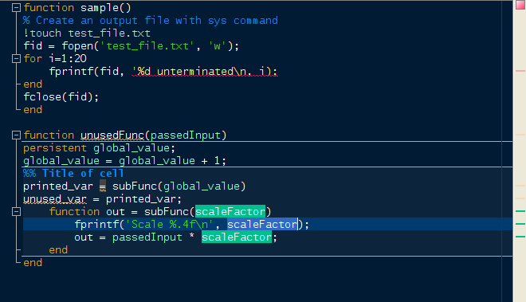

### Darkmate
Based on the [GTK stylesheet], "Darkmate",
by [Luigi Maselli](https://grigio.org/).

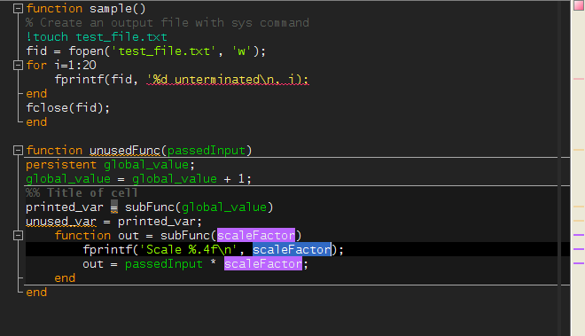

### Dark Steel
By [@scottclowe](https://github.com/scottclowe), inspired by the Darkmate and
Cobalt themes.

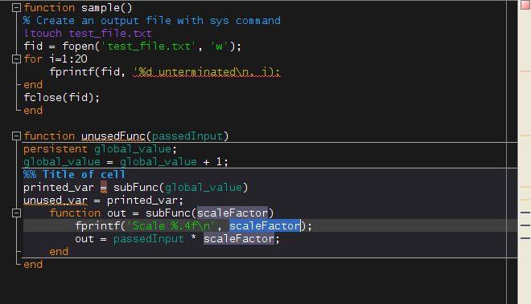

### Matrix
By [@scottclowe](https://github.com/scottclowe), using only colors present in
the terminals shown in the movie,
[*The Matrix*](http://www.imdb.com/title/tt0133093/).

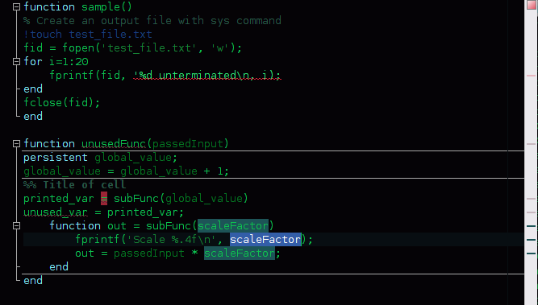

### Monokai
By [@dkearn](https://github.com/dkearn). Based on Sublime Text's Monokai theme. Change the font to Consolas to complete the look.

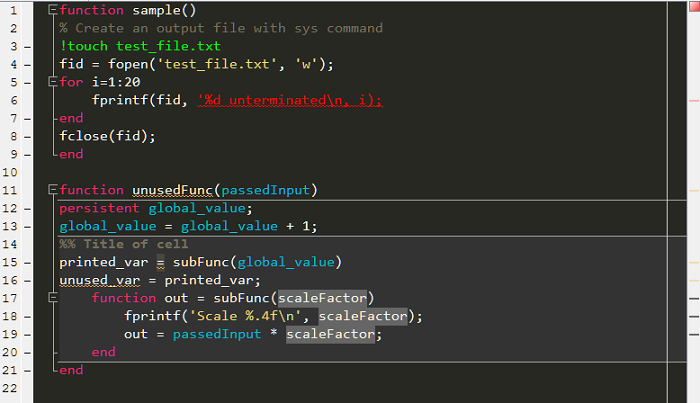

### Oblivion
Based on the [Gedit theme, "Oblivion"](https://github.com/mig/gedit-themes/blob/master/oblivion.xml),
by Paolo Borelli and GtkSourceView.

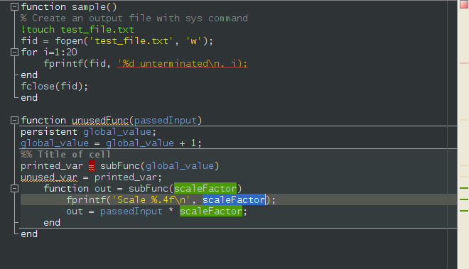

### Solarised Dark
Based on the [Solarized][Solarized] (1.0.0beta2) palette, in dark mode,
by [Ethan Schoonover].

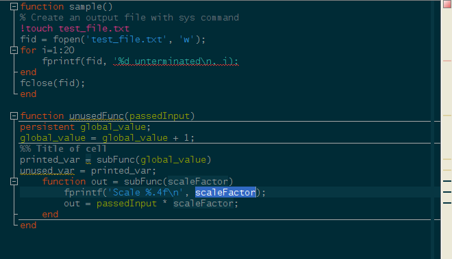

### Solarised Light
Based on the [Solarized][Solarized] (1.0.0beta2) palette, in light mode,
by [Ethan Schoonover].

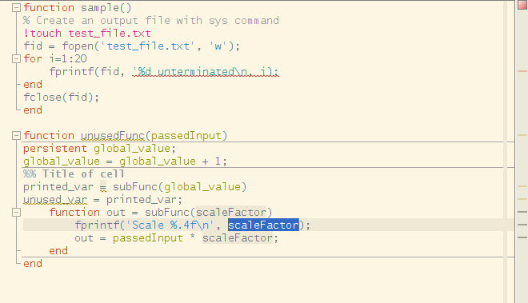

### Tango
Based on the colour palette for the [Tango Desktop Project].

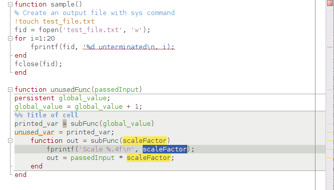

### Vibrant
Based on the [GTK stylesheet], "Vibrant", by Lateef Alabi-Oki.

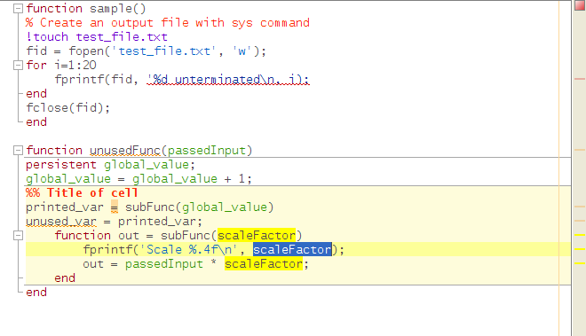

Default
-------

And of course, you can always return to the original MATLAB color scheme
provided by [MathWorks](https://www.mathworks.com/) using the `default.prf`
color preferences file.

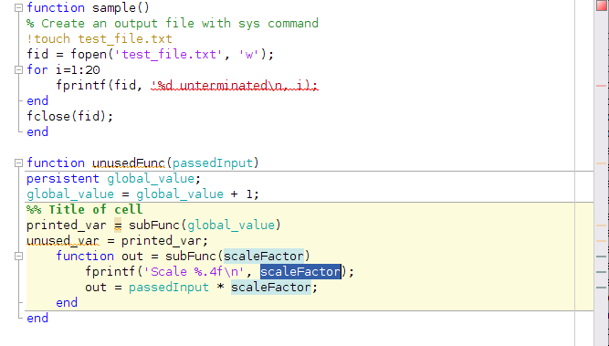

  [MATLAB Schemer package]: https://github.com/scottclowe/matlab-schemer
  [GTK stylesheet]: https://wiki.gnome.org/Projects/GtkSourceView/StyleSchemes
  [Solarized]: http://ethanschoonover.com/solarized
  [Ethan Schoonover]: http://ethanschoonover.com/
  [Tango Desktop Project]: http://tango-project.org/
